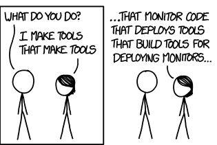
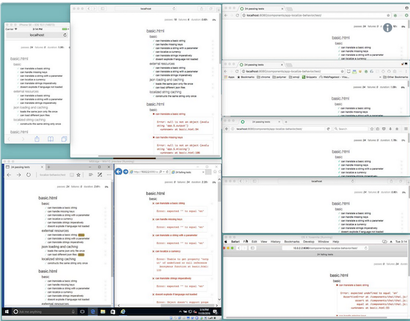
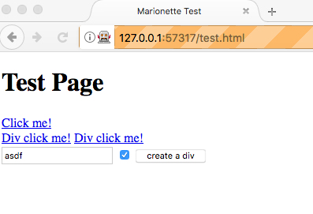
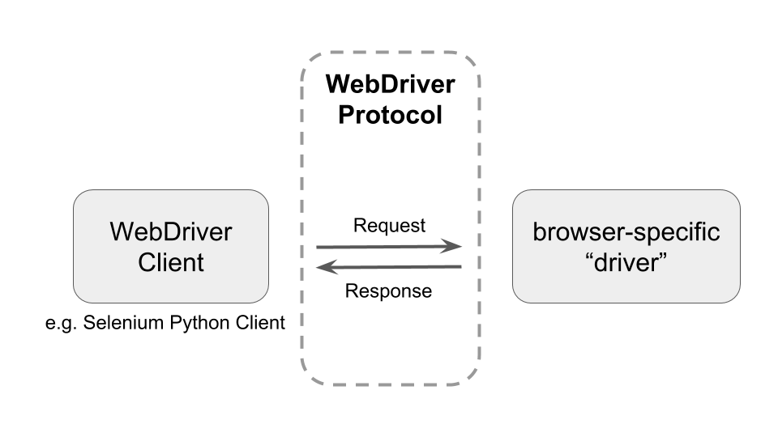
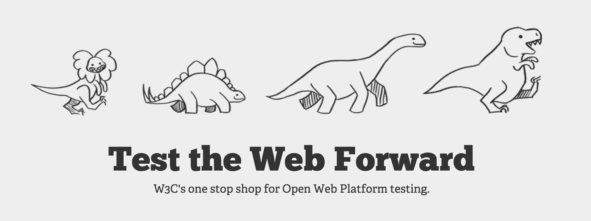
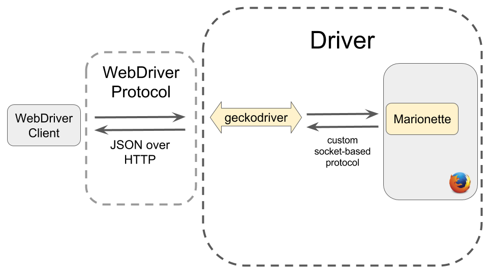
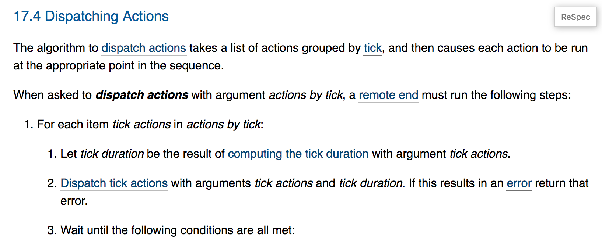

## Hello, I'm Maja.

* Software Engineer at Mozilla
* \@impossibus

<div class="fragment">

</div>

  <div class="notes">
  > Notes:
  >
  - [Slides](https://speakerdeck.com/mjzffr/remotely-control-this-browser-webdriver-and-the-path-to-an-interoperable-web)
  - Mozilla, non-profit behind Firefox
  - Defends the openness of the web platform
  - This xkcd comic is one way to describe what I do: I work on internal tools and tools that support other tools used by web developers.
  - The tools I work on are all centered around __browser automation__.
  - I will soon explain what motivates that work.

  </div>


## Example of Remote Control

<p class="mainImage">
  
</p>

  <div class="notes">
  > Notes:
  >
  - First, let's agree on some context: what does browser automation look like?
  - This gif is showing you an editor in the top half with some Python code
  describing browser behaviour for the purpose of functional tests. In the terminal window at the bottom, I run the tests.
  - This causes a new browser instance to launch, load a test page, and
  perform a bunch of actions on the page (mostly clicks).
  - The python script is simulating user interaction with the browser.

  </div>

## Web Compatibility


  <div class="notes">

  > Notes:
  >
  - Now onto our motivation: what should be web be like?
  - A person should be able to access _all_ web content with
   any device/platform and any browser.

  </div>

## Pain



  <div class="notes">

  > Notes:
  >
  * From the perspective of a web developer, cross-browser/platform
  support is not easy to achieve.
  * The developer is faced with a trade-off: spend my time getting this working for more users, or write some more features for just one browser/platform?
  * The user suffers because they can't access content or share with
  everyone.

  </div>


## Web Predictability

  <div class="notes">

  > Notes:
  >
  * Another way to think about the health of the web is in terms of
  _predictability_: Surprises are bad for developers.
  * A web developer's task is made harder because their code breaks in surprising ways, including regressions that pop up months after
  successful deployment.
  * What can we do to make web development less surprising and frustrating?

  </div>


## Web Standards ➔ Interoperable

  <div class="notes">

  > Notes:
  >
  * That's what web standards are all about.
  * Browser vendors and other interested parties come together to
  negotiate common ways of interacting with the web.
  * Web developers aim to follow web standards and best practices to deliver
  a consistent experience to as many users as possible.
  * These efforts help the web stay decentralized and open to new kinds of
   content, new ways to participate on the web.

  </div>

## Interoperability

<p style="text-align:center">
__open__ instead of __fragmented__</p>

  <div class="notes">

  > Notes:
  >
  - The ideal is that anyone can come along, build something on top of
    this shared open platform and thereby reach all web users.
  - On the other side of the spectrum, we can have lots of small pockets
    that don't interact. Imagine an extreme where building compatible
    web apps is pretty much impossible so that Android Opera users live in
    one slice of the web, whereas Windows Chrome only hang out in another
    part, etc.
  - One example of fragmentation is the distinct ecosystems for
    users of iOS and Android: App Store versus Google Play. A lot of those
    apps could just be web apps today, but when these platforms were first
    entering the market, mobile browsers weren't mature enough or consistent
    enough, so users were offered platform-specific apps instead. Today,
    developing a cross-browser, responsive web app is still hard, so lots of
    projects focus their efforts on native mobile apps instead. :(
  - Another example of the side-effects of fragmentation: if you choose
    to use a more affordable device that may imply that you have access to very different web content.

  </div>


## Tools for a healthy web

<p class="mainImage">
  
</p>


<div class="notes">
 > Notes:
 >
 - These are the ideals that motivate our work on WebDriver.
 - That is, we work on browser automation because it is the basis for tools
  that make developing for the web easier, whether you're working on a web app or a whole browser.

</div>


## Coming up

1. Why browser automation?
2. What is WebDriver? Selenium?
3. How does WebDriver work in Firefox?
4. Hey, let's add a WebDriver command to Firefox!

  <div class="notes">
  > Notes:
  >
  - What are these tools? As promised, we'll focus on WebDriver,
  which defines how browser automation will work in all browsers.
  - I'll also explain the relationship with [Selenium](http://www.seleniumhq.org/), a popular open
  source project for automating browsers.


  </div>


# Welcome to browser automation

  <div class="notes">

  > Notes:
  >
  - Let's get started by writing some Python code to automate Firefox.

  </div>

## Example

```python
session.get("https://www.mozilla.org/")
link = session.find_element_by_id("participate")
link.click()
```


  <div class="notes">
  > Notes:
  >
  - Assume `session` represents some sort of magical connection to a
    specific browser instance.
  - First we make the browser navigate to
    [mozilla.org](https://www.mozilla.org).
  - Then we search the DOM for an element with id "participate", and
    we tell the browser to click on that element.


  </div>

## Turned off by default



  <div class="notes">

  > Notes:
  >
  - Remote control does not affect day-to-day use of any browser.
  - There are measures in place to restrict this capability: no one wants a
    third party to take control over their browser.
  - As an extra precaution and reminder, when remote control is enabled
    users see a modified URL bar in Firefox.
  - I think Chrome and Safari have a similar visual cue.

  </div>


## Why automate?

Testing...

  <div class="notes">

  > Notes:
  >
  * Testing web apps, browser features, browser extensions
  * Catch regressions: make sure my site's still working when I change it

  </div>


## Beyond Testing

  <div class="notes">

  > Notes:
  >
  > WebDriver could be used:
  >
  * To make web development easier (enhance developer tools)
  * For browser instrumentation (screenshots on failure, enhanced logging,
    monitor performance)
  * To make it easier to report, describe and investigate web compatibility
    bugs: write or generate a specific, reproducible test case.
  * To make it easier to distinguish between browser bugs and web app bugs


  </div>

## How? WebDriver!

<p class="mainImage">
  
<p>


  <div class="notes">
  > Notes:
  >
  - WebDriver provides a communication protocol between a _client_ and a  
    _browser_. Each kind of browser is controlled by a "driver" built for it.
  - There are lots of WebDriver client libraries out there, in many
    different languages, but I'll provide examples using the Selenium Python
    client.

  </div>


## WebDriver Client Sends Commands to Browser


```python
session.get("https://www.mozilla.org/")
link = session.find_element_by_id("participate")
link.click()
```


  <div class="notes">
  > Notes:
  >
  - This is the same code snippet as before: it demos the Selenium Python
    client API.
  - Note that the terms "Selenium" and "Selenium WebDriver" and "Selenium 3"
    are pretty-much interchangeable.

  </div>


## Example: Talking to Firefox

```
pip install selenium
export PATH=$PATH:/path/to/geckodriver
```

Automation script:

```python
from selenium import webdriver

# e.g. check the web page title
session = webdriver.Firefox()
session.get("http://www.python.org")
assert "Python" in session.title
session.close()
```


  <div class="notes">
  > Notes
  >
  * Use a new version of Selenium WebDriver (> 3.3.1)
  * geckodriver is a program that allows Selenium to talk to Firefox.
    You'll learn more about it later.
  * `webdriver.Firefox()` is starting a _WebDriver session_. This takes care
    of starting the browser in "remote control" mode, as well as, setting
    relevant browser prefs that are more suitable for automation such as: do
    not warn when closing all tabs, don't show UI tour, don't run browser
    updates.

  </div>


##  <span class="longHeading">✨open source project to web standard!✨</span>


<p style="text-align:center; font-size:0.78em">
Selenium WebDriver ➔ W3C WebDriver Standard</p>


  <div class="notes">

  > Notes:
  >
  * This browser-automation idea started a long time ago with open source
    software that today is called Selenium WebDriver. Originally, the
    Selenium community maintained both the clients and the individual
    drivers for each browser.
  * Each browser driver has to be implemented differently in a way that is
    best suited to that particular browser. For example, Selenium's
    FirefoxDriver was a Firefox add-on.
  * Selenium grew very popular, especially for web testing. Gradually,
    browser vendors started implementing their own "drivers" to receive
    commands from Selenium. This makes a lot of sense: it's good for the web
    (see previous motivation about interoperability, etc.) and it's
    certainly easier for browser vendors to maintain their own drivers,
    since they are familiar with browser internals, etc. (It's kind of
    amazing that the Selenium community maintained a whole bunch of browser
    drivers on their own for so long.)
  * The W3C agreed that this should become a web standard so that all
    browsers implement WebDriver consistently. For something to become a standard, you need at least two independent implementations (✅) and
    a specification. The specification is pretty-much written now (✅).
 >
 > What does this imply?
 >
  * You write one automation script in your favourite language.
  * Run your script against any/all browsers.
  * Now we're in a transition period: from Selenium WebDriver with old
    drivers to new spec-compliant drivers.

  </div>

## Each WebDriver command is an HTTP request with a JSON payload

* `POST /session/<id>/window/maximize` 	
* `POST /session/<id>/element` 	
* `GET 	/session/<id>/title`
* `GET 	/session/<id>/screenshot`

<div class="notes">
> Notes:
>
- This list doesn't show any payloads, see next slide.
- The `<id>` refers to the WebDriver session that is connecting your client
  to a particular browser instance. Before you send any commands, you have
  to start a session. When you're done, you end the session.
- We'll see examples in a moment.
- List of
  [all commands](https://www.w3.org/TR/webdriver/#h-list-of-endpoints)

</div>


## WebDriver Protocol

Request: please navigate to mozilla.org

```
POST /session/0152f...a9e8/url
{"url": "https://www.mozilla.org/"}
```

Response: command was successful!

```
Status: 200
Data: {}
```

  <div class="notes">
  > Notes:
  >
  - Sending a POST request to the `url` endpoint means: "please navigate
    somewhere"
  - The command is aimed at session `0152f...a9e8` with
    one parameter: `url = https://www.mozilla.org/`
  - The JSON payload is `{"url": "https://www.mozilla.org/"}`
  - If the command is successful (the navigation completes),
    the driver will respond with a status of 200 and no data. _Note that the
    200 status here is from the driver; the HTTP server response from
    mozilla.org is a different concept._


  </div>


## Spec Implementation Status

<p style="text-align:center">
How many WebDriver commands work in each browser?</p>

  <div class="notes">
  > Notes:
  >
  * All majors browser vendors are working on implementing the
    WebDriver specification.
  * Firefox is the most spec-compliant now; there's a dedicated team working
    on it.
  * There are also Web Platform Tests (see next slide) for WebDriver, which
    helps browser vendors implement the spec consistently/correctly.

  </div>


## Aside:  Web Platform Tests



  <div class="notes">

  > Notes:
  >
  - W3C Web Platform Tests is a suite of tests that accompany all web
    standards (not just WebDriver). They are shared by all browser vendors
    to coordinate the effort toward web predictability.
  - As different browser vendors implement standards, they can contribute  
    tests for everyone else to use.
  - The tests are run against all browsers: measure how spec-compliant they
    are, detect when something breaks.
  - Volunteer contributions are welcome.

  </div>

# WebDriver in Firefox

  <div class="notes">
  > Notes:
  >
  > Now we'll take a deeper dive into the components that make the
    WebDriver protocol work in Firefox.

  </div>


## geckodriver + Marionette

<p class="mainImage">
  
</p>

  <div class="notes">

  > Notes:
  >
  - A WebDriver client sends JSON over HTTP to geckodriver, geckodriver
    translates that into a custom socket-based protocol understood by Firefox. geckodriver is written in Rust.
  - _Marionette_ is the component within Firefox that responds to WebDriver
    commands. It is kind of like a Firefox add-on with access to privileged,
    internal APIs. Marionette is written in JavaScript.


  </div>


## Firefox: Why not JSON over HTTP?

<p style="text-align:center">Based on existing remote debugging protocol instead.</p>

  <div class="notes">

  > Notes:
  >
  - When initially developing Marionette, it made more sense to take
  advantage of an existing method to communicate with the browser rather
  than reinvent the wheel.
  - Chrome works in a similar way.

  </div>

## You've started a WebDriver session. What happens when you send the "Get Title" command?

```
print session.title
```

## Processing a Command (1)

### Client

<div style="height:50px"></div>

Send HTTP request to geckodriver

```
GET 	/session/<session id>/title
```

## Processing a Command (2)

### geckodriver

<div style="height:50px"></div>

Translate and send to Marionette

The result is a message in the format __<length>:<JSON string>__

```
30:[0, 21, "getTitle", null]
```

<div class="notes">

> Notes:
>
- 30 refers to the length of the string `[0, 21, "getTitle", null]`
- 0 is the message type (request)
- 21 is the message id: Marionette has to respond in sequence. Responses
  are synchronous, sent in order, but requests are async and need to be
  distinguished by id.
- "getTitle" is the name of the command in Marionette.
- null means there are no parameters.

</div>

## Quick peek inside geckodriver

```Rust
(Get, "/session/{sessionId}/title",
 Route::GetTitle)
```

```Rust
GetTitle => (Some("getTitle"), None)
```

```Rust
impl ToJson for MarionetteCommand {
    fn to_json(&self) -> Json {
        Json::Array(vec![Json::U64(0),
                         self.id.to_json(),
                         self.name.to_json(),
                         self.params.to_json()])
    }
}
```

  <div class="notes">

  > Notes: these are simplified excerpts from
   [geckodriver](https://hg.mozilla.org/mozilla-central/file/tip/testing/geckodriver/src/marionette.rs)
   and a supporting library,
   [webdriver-rust](https://github.com/mozilla/webdriver-rust/blob/master/src/command.rs)
  >
  1. Map the `title` endpoint to GetTitle
  2. Translate to a Marionette command: `getTitle`
  3. Construct a 4-part request as expected by Marionette: [0, id, name, params]

  </div>


## Processing a Command (3)

### Marionette

<div style="height:50px"></div>

Parse stream of incoming packets (e.g. from geckodriver)

Request parsed into JSON: type, id, method, params
```
[0,21,"getTitle",{}]
```

## Processing a Command (4)

### Marionette

<div style="height:50px"></div>

Dispatch `cmd` ("getTitle") to the right driver method

```JavaScript
execute(cmd) {
  let fn = this.driver.commands[cmd.name];
  if (typeof fn == "undefined") {
    throw new UnknownCommandError(cmd.name);
  }
  let rv = yield fn.bind(this.driver)(cmd, resp);
  // send resp
}
```

<div class="notes">

> Notes: this is a simplified excerpt from [marionette](https://dxr.mozilla.org/mozilla-central/rev/c01aa84ded7eb0b3e691f8bcc5cd887c960a779e/testing/marionette/server.js#505)

</div>

## Processing a Command (5)

### Marionette

<div style="height:50px"></div>

Perform browser interaction to compute response.

```JavaScript
function getTitle() {
  return curContainer.frame.top.document.title;
}
```

Example response: type, id, error, result

```
[1,21,null,{"value":"Cats in Boxes"}]
```

<div class="notes">
> Notes: excerpt from [listener.js](https://dxr.mozilla.org/mozilla-central/source/testing/marionette/listener.js)
>
- 1 is the message type: now it's a response (versus 0, which is a request)
- 21 is the id that matches the original request
- null means there's no error

</div>


## Processing a Command (6)

<div style="height:50px"></div>

Finally, the response is sent back, translated by geckodriver to JSON-over-HTTP:

```
Status: 200
Data: {"value":"Cats in Boxes"}
```

# Implementing a Command

  <div class="notes">

  > Notes:
  >
  > Most WebDriver commands are functional in Firefox -- many were
  implemented years ago -- but not all of them are spec-compliant yet.
  > This is also true of other browsers: the commands work, but not
  consistently.
  > By "implementing a command", I mean modifying or rewriting parts of
  Marionette to make it follow the WebDriver spec.
  > It's an interesting task because you end up interacting with spec
  authors, digging into other web standards (like UI events), comparing
  with other browsers and trying to reconcile what the browser should
  actually do in response to a command.


  </div>


## Example: The "Actions" Command

POST /session/\<id\>/actions

```JSON
{"actions": [{
  "parameters": {"pointerType": "mouse"},
  "type": "pointer",
  "id": "myMouse",
  "actions": [
    {"type": "pointerMove", "y": 10, "x": 80,
     "duration": 50},
    {"type": "pointerDown", "button": 0},
    {"type": "pointerUp", "button": 0}
  ]
}]}
```

  <div class="notes">

  > Notes:
  >
  - I'll describe what I had to do to implement the Actions command.
  - The above request describes a sequence of steps to perform with a mouse:
    move the pointer to coordinates (80, 10) on the page in 50 ms, press the
    primary button, release the primary button.
  - In general, actions commands are meant to describe a timeline of input
    device behaviour.
  - The above shows a 1-layer timeline: just a mouse. You could instead
    describe many devices (many layers) doing different things
    simultaneously, like a mouse and keyboard, or two fingers on a touch
    screen.

  </div>

## Read the spec



  <div class="notes">

  > Notes:
  >
  - This small piece of the WebDriver Actions spec gives you a taste of
  specification language and level of detail.


  </div>

## Read the spec

* Spec describes what should happen and often how (at a high level)
* Not set in stone: clarify and discuss as we implement

  <div class="notes">
  > Notes:
  >
  * The WebDriver spec is pretty much done but there's still room for
    slight changes and fixes.
  * The spec describes algorithms at a high-level
  * Additional decisions left up to the implementor: data representation,   
    optimizations, use of programming language features.
  * Details, edge cases may still be missing.


  </div>


## Write web-platform tests

Examples:

* Invalid payload is rejected with the correct kind of error.
* pointerDown followed by pointerUp results in expected events.
* pointerMove ends up at correct coordinates.


  <div class="notes">
  > Notes:
  >
  - Typically, each
    [test](https://github.com/w3c/web-platform-tests/tree/master/webdriver/actions)
    loads a document, sends a WebDriver request,
    compares the result to what we'd expect to see if an actual human were
    interacting with the document.
  - As a result, writing WebDriver spec tests involves a mix of Python
    (the actual test), as well as some JavaScript to introspect what's
    happening in the web document.
  - You also need to hook up the WebDriver test client
    [to your new command](https://github.com/w3c/web-platform-tests/blob/master/tools/webdriver/webdriver/client.py#L75).

  </div>


## Add to marionette + geckodriver

<p style="text-align:center">First, parse and validate the command payload</p>

<div class="notes">
> Notes:
>
- See [action.Sequence](https://dxr.mozilla.org/mozilla-central/source/testing/marionette/action.js#785)


</div>


## Control the order of DOM events

```JavaScript
action.dispatch = function (chain, ...) {
  let chainEvents = Task.spawn(function* () {
    for (let tickActs of chain) {
      yield action.dispatchTickActions(
          tickActs,
          action.computeTickDuration(tickActs),
          ...);
    }
  });
  return chainEvents;
};
```


  <div class="notes">
  > Notes:
  >
  * Excerpt from [action.dispatch](https://dxr.mozilla.org/mozilla-central/rev/c01aa84ded7eb0b3e691f8bcc5cd887c960a779e/testing/marionette/action.js#941)
  * Recall our previous description of the multi-layer timeline for all
    input devices.
  * The idea is to divide this timeline into discrete ticks (points in time)
    and trigger all the events for one tick simultaneously and
    asynchronously. When all the events for the first tick are done
    (keyboard, mouse, etc), then trigger all the events for the second tick,
    and so on.
  * From the client's perspective, the action command doesn't return a
    response until all the events in the sequence are complete.
  * This is implemented in Marionette with Promises.
  * There's more: code for constructing and triggering events, calculating
    how to update pointer coordinates, track input device state, etc.
  </div>


# What next?

  <div class="notes">

  > Notes:
  >
  > Now you have an overview of WebDriver, browser automation,
    why it's important for the health of the web, how it works in Firefox,
    and how to approach adding a new command. What can do you do with this
    knowledge? Work with us on fun browser bugs, help improve WebDriver, and
    help with web predictability!

  </div>

## Ways to contribute

1. Use __Selenium >3.3.1__ with __geckodriver__ + __Firefox Nightly__
   then file new issues on Github
2. Test-drive documentation, help us clarify/update

  <div class="notes">

  > Notes:
  >
  * Use Selenium to test your web app,
    [report issues](https://github.com/mozilla/geckodriver)
    with detailed logs, steps to reproduce
  * Documentation to try out: [using geckodriver](https://developer.mozilla.org/en-US/docs/Mozilla/QA/Marionette/WebDriver) and [Marionette developer setup](https://developer.mozilla.org/en-US/docs/Mozilla/QA/Marionette/Developer_setup)

  </div>

## Ways to contribute

4. Write spec tests __(Python, pytest, JS)__
6. Work on bugs in spec implementation __(JS, Rust)__
5. Tackle some Mozilla test-harness bugs __(Python)__

<div class="notes">

> Notes:
>
* Example of adding WebDriver spec tests:
  [Bug 1357590 ](https://bugzilla.mozilla.org/show_bug.cgi?id=1357590)
* A good entry point for working on spec implementation bugs is in    
  [geckodriver issues](https://github.com/mozilla/geckodriver/issues), some
  of which need to be fixed in Marionette. Or if you report a new issue, you
  might enjoy figuring out how to fix it.
* For Mozilla test-harness bugs, take a look at [Bugs Ahoy](https://www.joshmatthews.net/bugsahoy/?automation=1&py=1)
</div>

## Remotely control this browser to make a better Web ❤️🤖


  <div class="notes">

  > Notes:
  >
  - Achieving and maintaining web predictability is a huge amount of work.
    It's a moving target.
  - How do you maximize progress? Eliminate friction! Make
    collaboration a breeze! Multiply everyone's efforts with automation!
  - WebDriver enables a whole class of tools to ease all
    the work around web compatibility/predictability, yay.

  </div>


## Thanks!

I'm Maja Frydrychowicz. Contact:

* IRC: __maja_zf__ on irc.mozilla.org and irc.w3.org
* \@impossibus

<p class="mainImage">
  
</p>


## Resources

<div class="resources">
\#ateam channel on irc.mozilla.org

* [https://wiki.mozilla.org/User:Mjzffr/New_Contributors](https://wiki.mozilla.org/User:Mjzffr/New_Contributors)
    * [http://www.erranderr.com/blog/webdriver-ontology.html](http://www.erranderr.com/blog/webdriver-ontology.html)
    * [http://vakila.github.io/blog/marionette-act-i-automation/](http://vakila.github.io/blog/marionette-act-i-automation/)
* [https://developer.mozilla.org/en-US/docs/Mozilla/QA/Marionette/WebDriver](https://developer.mozilla.org/en-US/docs/Mozilla/QA/Marionette/WebDriver)
* [https://github.com/mozilla/geckodriver](https://github.com/mozilla/geckodriver)
    * [https://github.com/mozilla/webdriver-rust](https://github.com/mozilla/webdriver-rust)
* [https://github.com/w3c/web-platform-tests/tree/master/webdriver](https://github.com/w3c/web-platform-tests/tree/master/webdriver)


</div>
